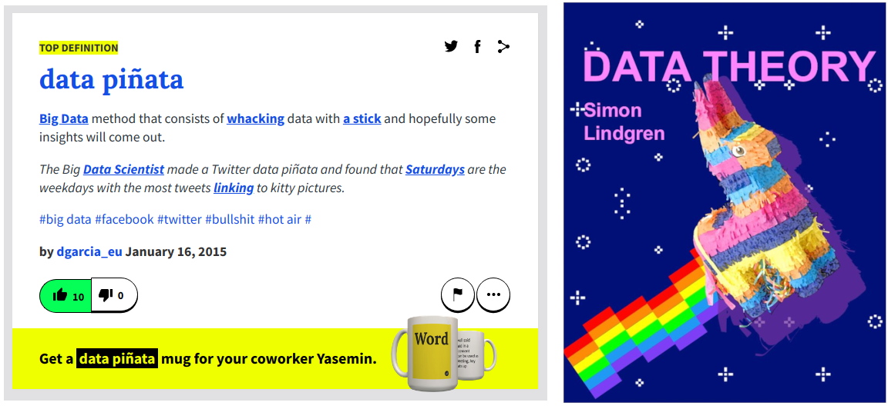
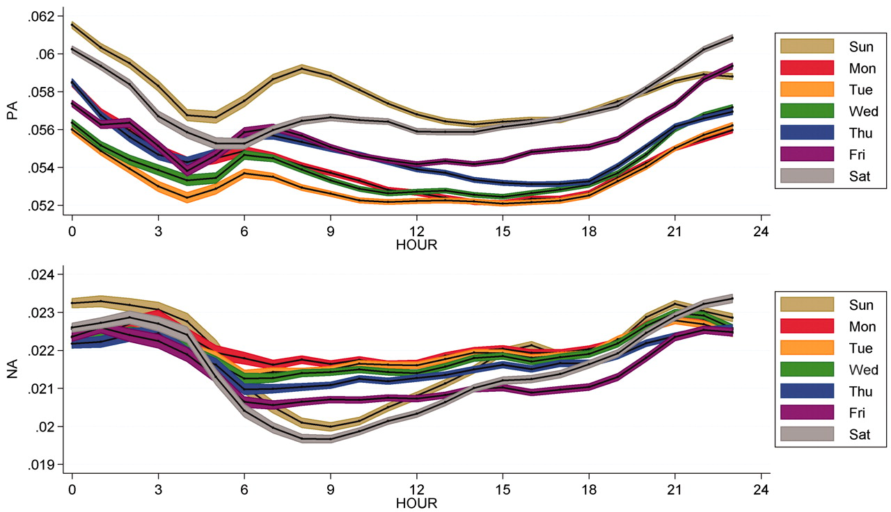
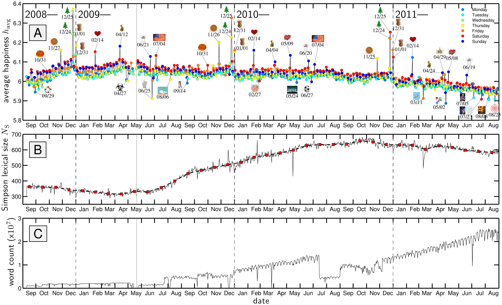
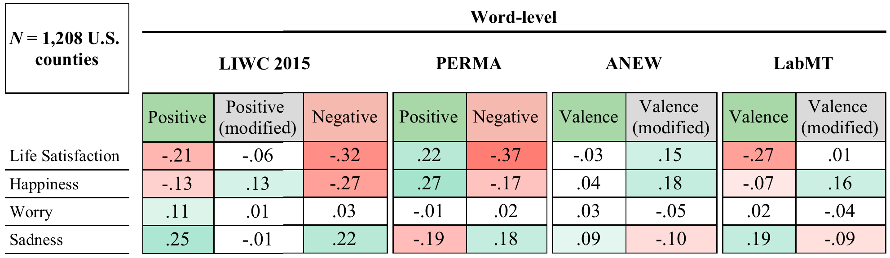
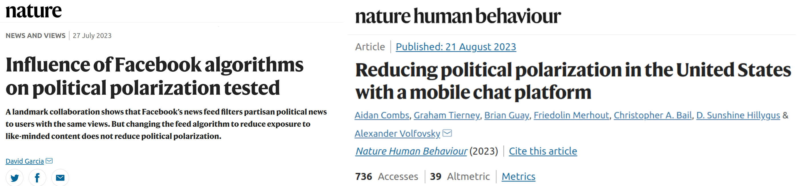
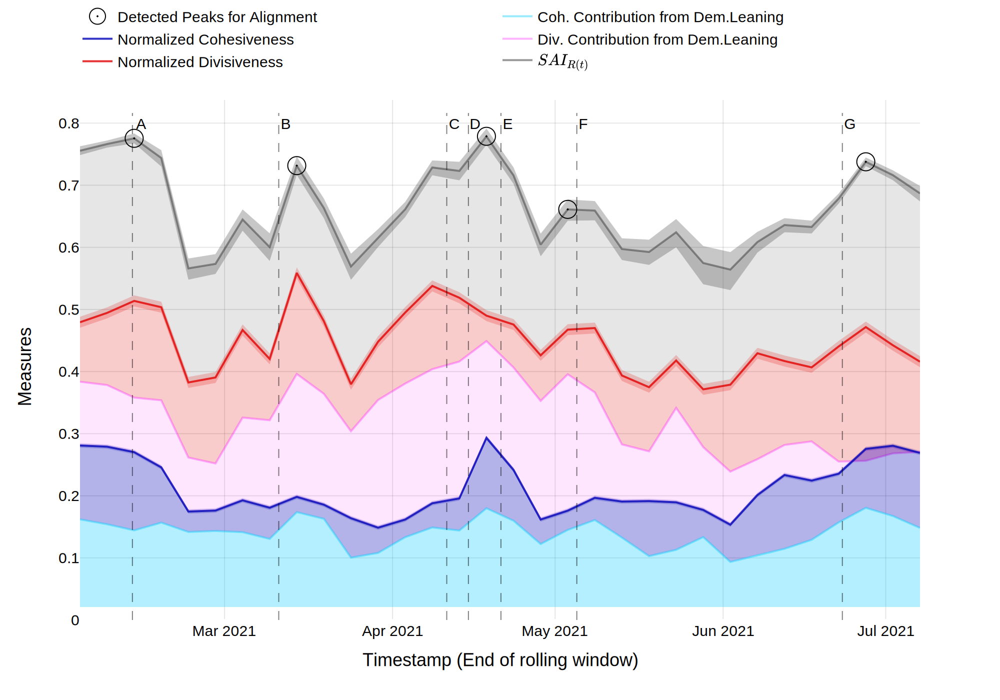
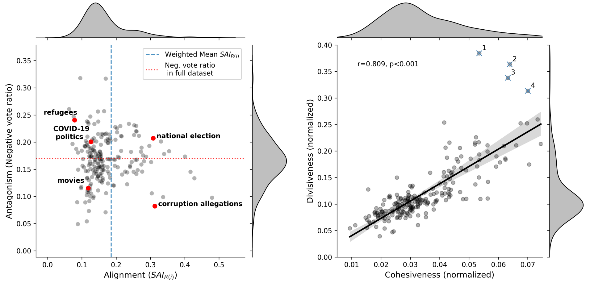

```{r xaringan-themer, include=FALSE, warning=FALSE}
#This block contains the theme configuration for the CSS lab slides style
library(xaringanthemer)
library(showtext)
style_mono_accent(
  base_color = "#5c5c5c",
  text_font_size = "1.5rem",
  header_font_google = google_font("Arial"),
  text_font_google   = google_font("Arial", "300", "300i"),
  code_font_google   = google_font("Fira Mono")
)
```

```{r setup, include=FALSE}
options(htmltools.dir.version = FALSE)
```


layout: true
<div class="my-footer"><span>David Garcia - NETHIKE</span></div> 

---

background-image: url(figures/AboutUS.svg)
background-size: 98%

---

# Our Research Topics


---

# Outline

## 1. Challenges in Social Media Data Analysis

## 2. Social Media Macroscopes of Emotions

## 3. Detecting Individual Emotions in Social Media

## 4. Unpacking Polarization in Online Discussions

---

## *Computational* in Computational Social Science
It can have three meanings:

- **Digital**<br> 
Based on large datasets of human behavior, for example produced by the Web and social media

- **Computerized**<br>
The quantitative analysis of data in an automated, tractable, repeatable, and extensible fashion

- **Generative**<br>
Application of data and results to design of agent-based models that explain complex social phenomena and motivate interventions

---

# Avoiding data piñatas

```{r, echo=FALSE, out.width=1050}

```

---

## The Hype Cycle of Computational Social Science
<center>
```{r, echo=FALSE, out.width=900}
knitr::include_graphics("figures/Hype1.svg")
```

---
## The Hype Cycle of Computational Social Science
<center>
```{r, echo=FALSE, out.width=900}
knitr::include_graphics("figures/Hype3.svg")
```


---

## Strengths and weaknesses of digital trace data

**Strengths:**
- Complementary approach to traditional survey and experimental methods
- Unprecedented scales and granularities
- Ease of data access, replicability of results
- Potentially high external validity, behavior in vivo

**Weaknesses:**
- Limits to internal validity: Lack of counterfactuals hinders causal analysis
- Self-selection bias: Who talks? Normalization issues: Who is silent?
- Data gatekeepers, Twitter as a model organism
- Intractability of black-box predictions and data piñatas

<div style="font-size:15pt">
Bit By Bit: Social Research in the Digital Age. M. Salganik (2017)
</div>

<div style="font-size:15pt">
Meaningful measures of human society in the twenty-first century. D. Lazer et al. (2021)
</div>
---

background-image: url(figures/VennV2-1.svg)
background-size: 97%
---
background-image: url(figures/VennV2.svg)
background-size: 97%
---

layout: true
<div class="my-footer"><span>
<a href=https://arxiv.org/abs/2107.13236> Social media emotion macroscopes reflect emotional experiences in society at large. David Garcia, Max Pellert, Jana Lasser, Hannah Metzler. https://arxiv.org/abs/2107.13236 (2021)</a></span></div>

---

# Social Media Macroscopes of Emotions

## 1. Challenges in Social Media Data Analysis

## *2. Social Media Macroscopes of Emotions*

## 3. Detecting Individual Emotions in Social Media

## 4. Unpacking Polarization in Online Discussions

---

# Social Media Macroscopes of Emotions

.pull-left[
```{r, echo=FALSE, out.width=1100}

```
<font size="5">
<a href="https://science.sciencemag.org/content/333/6051/1878/"> Diurnal and seasonal mood vary with work, sleep, and daylength across diverse cultures. Golder & Macy, Science (2011) </a>
</font>
]

.pull-right[
```{r, echo=FALSE, out.width=1100}

```

<font size="5">
<a href="https://journals.plos.org/plosone/article?id=10.1371/journal.pone.0026752"> Temporal patterns of happiness and information in a global social network: Hedonometrics and Twitter. Dodds et al. PLoS One (2011) </a>
</font>
]

---


## Limits of Social Media Data to Study Emotion

```{r, echo=FALSE, out.width=1100}

```

[Estimating geographic subjective well-being from Twitter: A comparison of dictionary and data-driven language methods. Jaidka et al. PNAS (2020)](https://www.pnas.org/content/117/19/10165.short)

---

# Validating a UK emotion macroscope

```{r, echo=FALSE, out.width=975, fig.align='center'}
knitr::include_graphics("figures/MacroTest2.svg")
```

---

# Sadness in Twitter and YouGov

```{r, echo=FALSE, out.width=1200, fig.align='center'}
knitr::include_graphics("figures/Sadness.svg")
```

- Similar results with dictionary-based and supervised methods (r~0.65)
---
# Anxiety in Twitter and YouGov

```{r, echo=FALSE, out.width=1200, fig.align='center'}
knitr::include_graphics("figures/Anxiety.svg")
```

- Improvement thanks to gender information in tweets

---
# Joy in Twitter and YouGov

```{r, echo=FALSE, out.width=1200, fig.align='center'}
knitr::include_graphics("figures/Joy.svg")
```

- Good correlation with supervised method but no correlation with dictionary-based method

---

layout: true
<div class="my-footer"><span>
<a href=https://www.nature.com/articles/s41598-022-14579-y>
Validating daily social media macroscopes of emotions. Max Pellert, Hannah Metzler, Michael Matzenberger, David Garcia. Scientific Reports (2022)</a></span></div>

---

## Reproducing with an Austrian daily macroscope

.pull-left[

- 20-day emotion survey in derstandard.at (N=268,128)
- Daily frequency, 3-day windows

- Text from Der Standard forum (N=452,013)

- Austrian tweets (N=515,187) filtered as UK macroscope

- Compared dictionary-based (LIWC) and supervised model (GS)

]
.pull-right[
```{r, echo=FALSE, out.width=900}
knitr::include_graphics("figures/DS1.svg")
```
]

---

## Online Media for Social Sensing of Emotions

```{r, echo=FALSE, out.width=850, fig.align='center'}
knitr::include_graphics("figures/socialsensing.svg")
```

---

# Detecting Individual Emotions in Social Media

## 1. Challenges in Social Media Data Analysis

## 2. Social Media Macroscopes of Emotions

## *3. Detecting Individual Emotions in Social Media*

## 4. Unpacking Polarization in Online Discussions

---


layout: true
<div class="my-footer"><span><a href="https://arxiv.org/abs/2304.10973v1"> LEIA: Linguistic Embeddings for the Identification of Affect. Segun Taofeek Aroyehun, Lukas Malik, Hannah Metzler, Nikolas Haimerl, Anna Di Natale, David Garcia. Arxiv preprint (2023)</a></span></div> 

---

## Challenges in individual emotion detection

**The problem with sentiment analysis: Writer versus reader emotions**

```{r, echo=FALSE, out.width=950, fig.align='center'}

```

Current sentiment analysis approaches assume that the **ground truth** is an annotation of emotions by **a reader**, often a student or a crowdsourcing worker

---

### LEIA: Linguistic Embeddings for the Identification of Affect


---

# Datasets summary

- Vent dataset samples:


- Out-of-domain validation datasets:
<center>  </center>

---

# Results in Vent

<center>  </center>

LEIA outperforms supervised and unsupervised methods for all emotions and test datsets. $F_1$ values between 70 and 80.

---

# Out-of-domain results

.center[]

---

# Out-of-domain results


- LEIA is best or tied with the best in all out-of-domain tests
- LEIA is best or tied with the best in all emotions except Fear in TEC
- LEIA vs VADER vs LIWC in sentiment classification:


---

# The challenge of comparing with GPTx

.center[]

---

# Error analysis with LIME

.center[]

Try it yourself:
https://huggingface.co/saroyehun/LEIA-large

---


layout: true
<div class="my-footer"><span>
<a href=https://arxiv.org/abs/2307.06571> 
Unpacking polarization: Antagonism and Alignment in Signed Networks of Online Interaction. E. Fraxanet, M. Pellert, S. Schweighofer, V. Gómez, D. Garcia.https://arxiv.org/abs/2307.06571 (2023)</a></span></div>


---


# Unpacking Polarization in Online Discussions

## 1. Challenges in Social Media Data Analysis

## 2. Social Media Macroscopes of Emotions

## 3. Detecting Individual Emotions in Social Media

## *4. Unpacking Polarization in Online Discussions*

---

## The Challenge of Mitigating Online Polarization


 <font size="5">

- Changes in feed algorithms have weak effects if applied only to part of the population
- Alternative: recommend content with cross-partisan appeal
  - It can be contentious but not necessarily across the polarization fault line
  - What and when? Finding this content requires new models and methods

[Influence of Facebook algorithms on political polarization tested. David Garcia. Nature (2023)](https://rdcu.be/djT2c)
[Breaking the Social Media Prism: How to Make Our Platforms Less Polarizing. Chris Bail (2021)](https://press.princeton.edu/books/hardcover/9780691203423/breaking-the-social-media-prism)
</font>

---
# Unpacking (Affective) Polarization
.center[]
---
# Data on Signed Online Discussions
.center[]
Birdwatch (now Community Notes) and DerStandard comments (Austrian news)
They contain political discussions with explicit signed, timestamped interactions
---

## From Interactions to Relations to Polarization


---
# Edge Frustration and Signed Alignment
.center[]
 <font size="5">
[Balance and frustration in signed networks. S. Aref and M. Wilson. Complex Networks (2019)](https://doi.org/10.1093/comnet/cny015)
 </font>
---

# Alignment versus Antagonism

.center[]

---
# Unpacking Polarization Pipeline

.center[]

---
.center[]
---

## Temporal Evolution of Birdwatch

.center[]
---

## Peaks and events in Birdwatch
.center[]

---

## Antagonism and Alignment in Der Standard

.center[]

---

# Effects Over Time in Der Standard

.center[]

---

# Elections and Alignment in Der Standard

.center[]

---

# References

<a href=https://arxiv.org/abs/2107.13236> Social media emotion macroscopes reflect emotional experiences in society at large. David Garcia, Max Pellert, Jana Lasser, Hannah Metzler. (2021)

<a href=https://www.nature.com/articles/s41598-022-14579-y>
Validating daily social media macroscopes of emotions. Max Pellert, Hannah Metzler, Michael Matzenberger, David Garcia. (2022)

<a href="https://arxiv.org/abs/2304.10973v1"> LEIA: Linguistic Embeddings for the Identification of Affect. S. Aroyehun, L. Malik, H. Metzler, N. Haimerl, A. Di Natale, D. Garcia. (2023)</a>

[Unpacking polarization: Antagonism and Alignment in Signed Networks of Online Interaction. Emma Fraxanet, Max Pellert, Simon Schweighofer, Vicenç Gómez, David Garcia. (2023)](https://arxiv.org/abs/2307.06571)

.center[**More at: [www.dgarcia.eu](https://dgarcia.eu) and [@dgarcia_eu](https://twitter.com/dgarcia_eu)**  
**Thanks for listening!**]

